# 🤖 Assistant Intelligent RAG Multimodal

Projet de Master : **Assistant Intelligent Multimodal basé sur Retrieval-Augmented Generation (RAG)** 
Développé dans le cadre du **Master Web Intelligence et Data Science**  
Université Sidi Mohamed Ben Abdellah – Faculté des Sciences Fès / Université Sorbonne Paris Nord

---


## 📌 Contexte et Objectifs
Avec l’évolution rapide des technologies d’IA, les chatbots intelligents sont devenus essentiels dans le **support client**, l’**assistance virtuelle** et la **recherche documentaire**.  
Ce projet vise à développer un assistant multimodal capable de comprendre et traiter des **questions en texte, audio ou fichiers (PDF, DOCX, images)**, et de fournir des réponses précises en s’appuyant sur une base documentaire indexée.

Objectifs principaux :
- Intégrer la **reconnaissance vocale** (Whisper).
- Utiliser la **recherche documentaire sémantique** (FAISS + embeddings).
- Générer des réponses contextuelles avec **Gemini**.
- Gérer un **historique conversationnel** multi-utilisateurs.

---

## 🏗️ Architecture du Système
Le système repose sur un pipeline modulaire :
1. **Entrées utilisateur** : texte, audio (transcrit par Whisper), fichiers (PDF, DOCX, images via OCR).  
2. **Prétraitement** : extraction, nettoyage, segmentation en chunks.  
3. **Indexation** : embeddings générés avec *sentence-transformers* et stockés dans **FAISS**.  
4. **Recherche & reranking** : sélection des documents les plus pertinents.  
5. **Historique conversationnel** : conservation du contexte grâce à SQLite + SQLAlchemy.  
6. **Génération de réponses** : modèle **Gemini 2.5 Pro**.  

📌 Schéma de l’architecture :  
.png)

---

## 📊 Gestion des Données
- **Sources** : documents utilisateurs, bases internes et externes.  
- **Segmentation (chunking)** : passages cohérents de 500 tokens avec chevauchement.  
- **Embeddings** : `sentence-transformers/all-MiniLM-L6-v2`.  
- **Indexation** : FAISS pour la recherche rapide et scalable.  

---

## 🛠️ Technologies Utilisées
- **Langages & Frameworks** : Python, Flask, JavaScript, HTML/CSS.  
- **Modèles IA** : Whisper (ASR), Gemini 2.5 Pro (LLM), Sentence-transformers.  
- **Vectorisation & Recherche** : FAISS.  
- **Base de données** : SQLite + SQLAlchemy.  

📌 Capture d’écran interface utilisateur :  
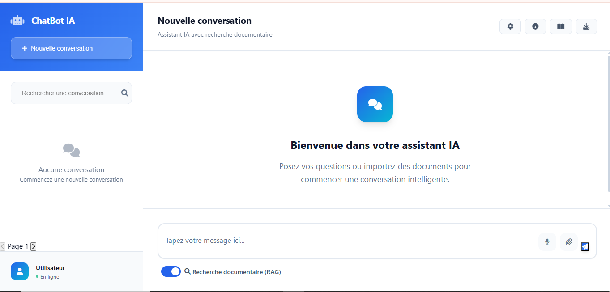

---

## 🚀 Fonctionnalités
- 📂 **Upload de fichiers** (PDF, DOCX, images via OCR).  
- 🎙️ **Questions audio** (transcrites automatiquement).  
- 📑 **Recherche documentaire augmentée** par embeddings.  
- 🧠 **Historique conversationnel** multi-sessions.  
- 🔎 **Visualisation des sources** utilisées pour générer la réponse.  

---

## 📸 Démonstration
Exemples d’utilisation :  
- ❓ Questions générales  
  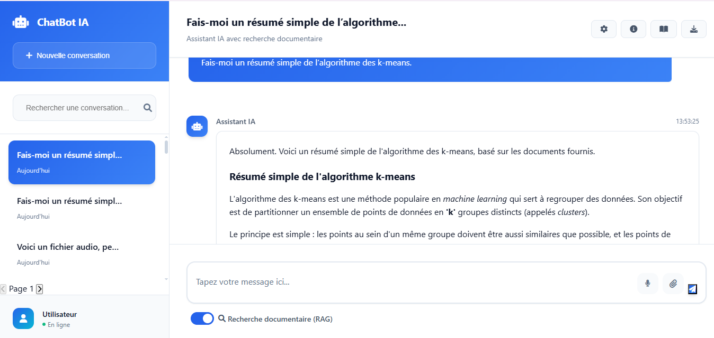
  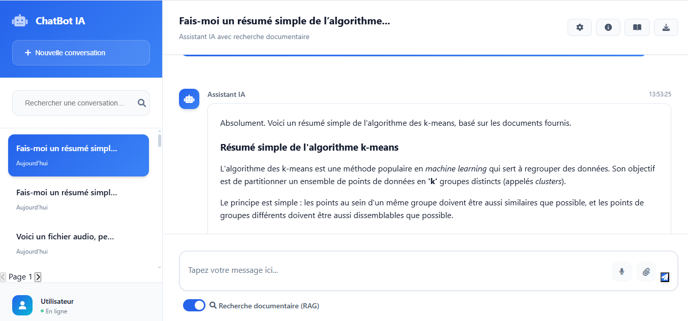  
  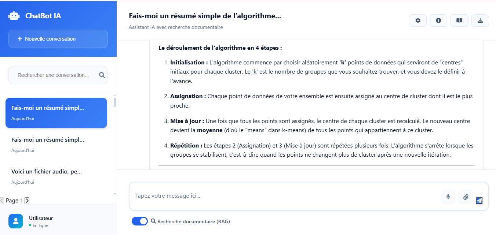
  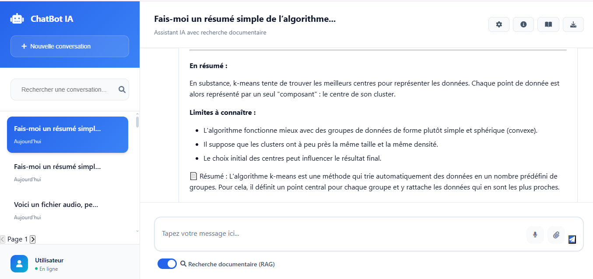
  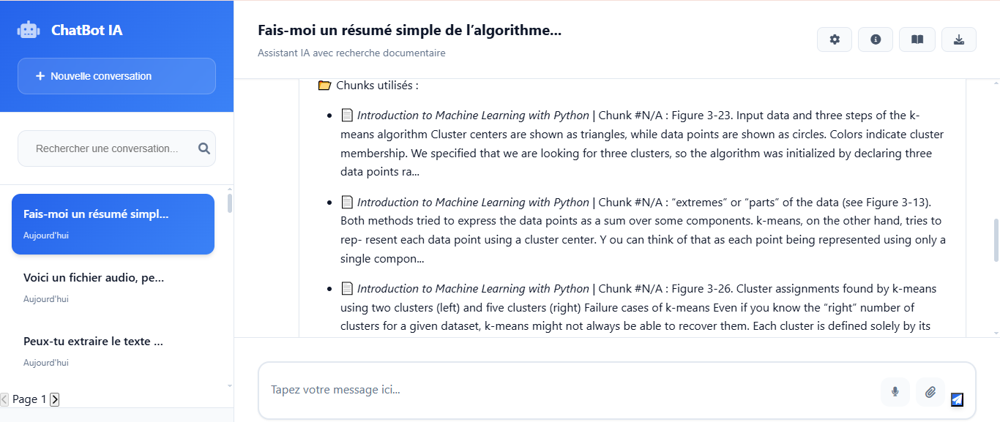   

- 📂 Questions multimodales avec PDF  
  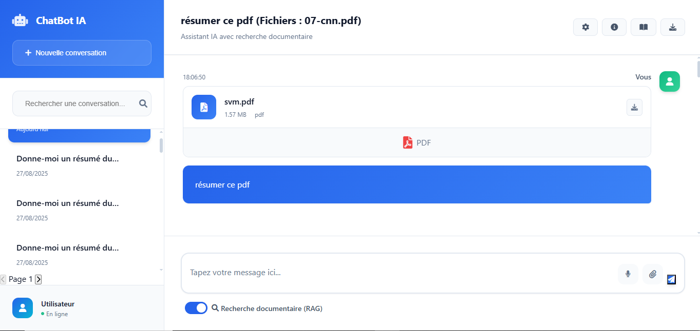
  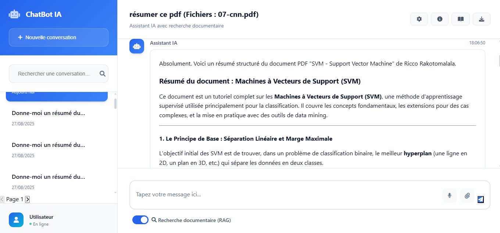  
    
  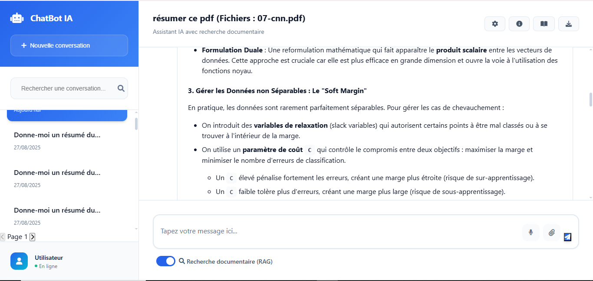  
  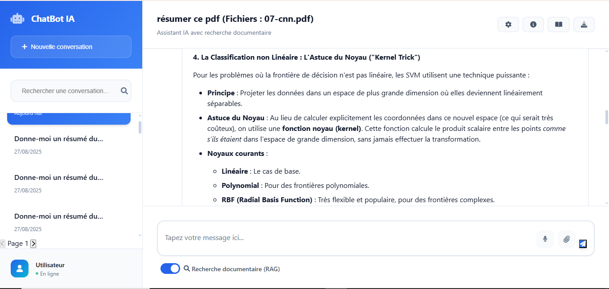  
  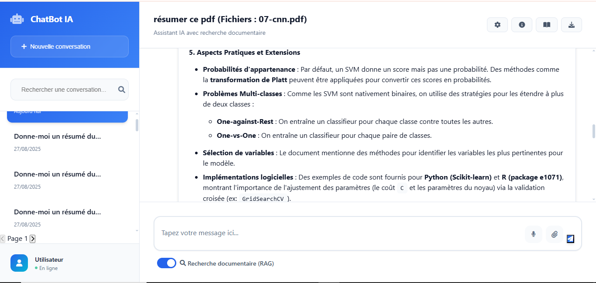  
  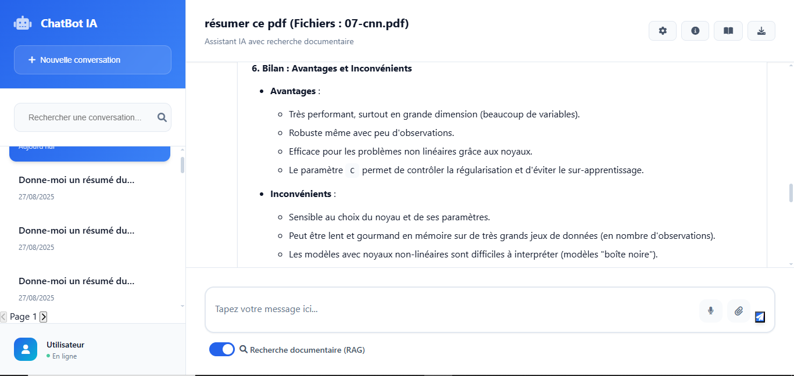  
  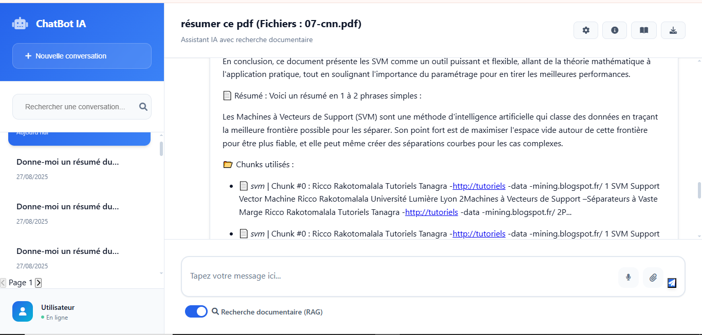   

- 🖼️ Questions avec image (OCR)  
  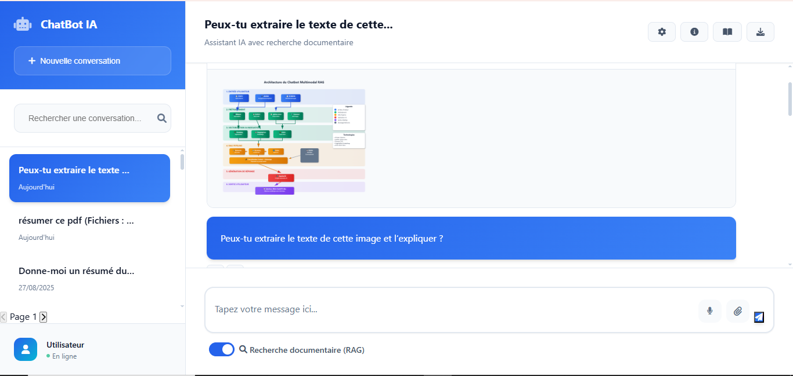  
  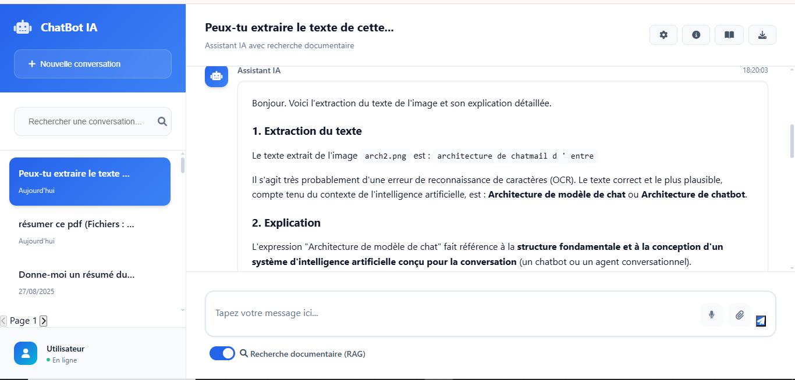 
  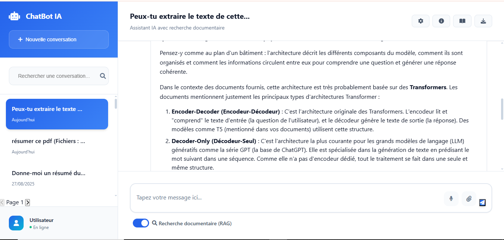 
  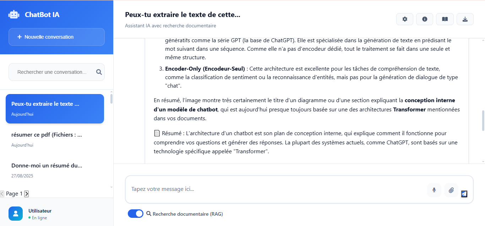 

- 🎤 Questions audio  
    
  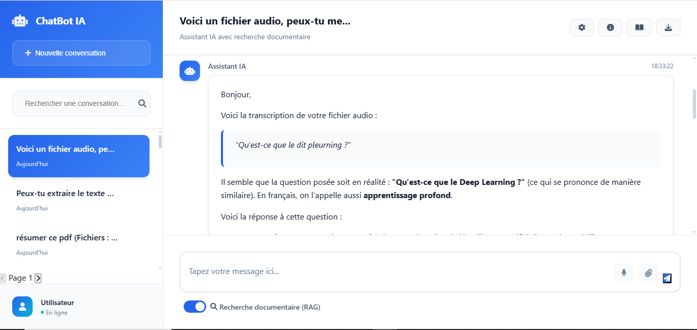 
  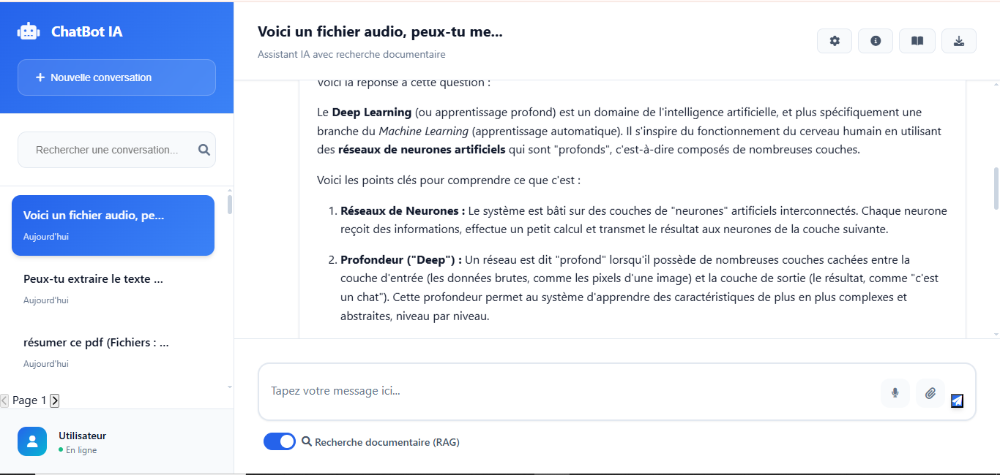 
   
  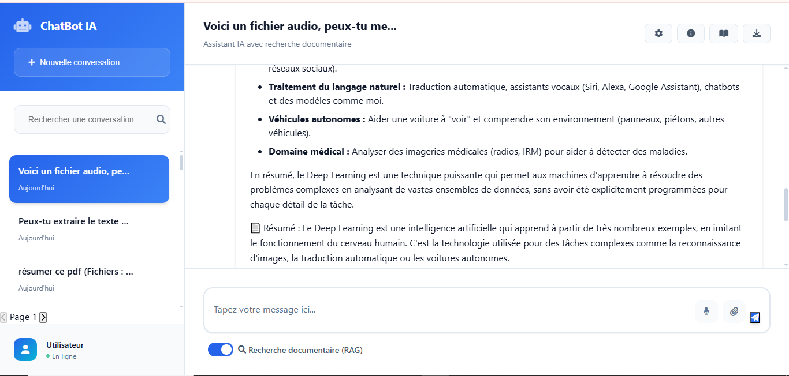 

- 📜 Visualisation des chunks de documents utilisés  
  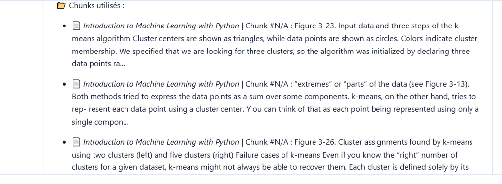  

---

## ⚠️ Limites Actuelles
- Mémoire contextuelle limitée (perte sur longues conversations).  
- Dépendance aux performances de FAISS sur gros corpus.  
- Qualité des réponses variable selon les documents indexés.  
- Mise à jour de l’index encore manuelle.  

---

## 🔮 Améliorations Futures
- Gestion avancée de la mémoire conversationnelle.  
- Scalabilité et optimisation de l’index FAISS.  
- Pipeline automatisé d’ingestion de documents.  
- Support élargi de formats multimédias.  
- Dashboard interactif pour le suivi des conversations.  

---

## 📚 Conclusion
Ce projet propose un **assistant intelligent multimodal RAG**, combinant **indexation documentaire**, **multimodalité (texte, audio, fichiers)** et **génération contextuelle**.  
Il constitue une base solide pour des applications réelles en **assistance virtuelle** et **traitement documentaire intelligent**.  

---
## 📚 Rapport complet

Le rapport détaillé est disponible en [PDF](./assets/chatbot.pdf).


## 👤 Auteur
**Bouizdouzene Bilal**  
_Master Web Intelligence et Data Science_  
Université Sidi Mohamed Ben Abdellah – Fès / Université Sorbonne Paris Nord

---

## ⚙️ Installation & Exécution
```bash
# Cloner le dépôt
git clone https://github.com/BilalBouizdouzene/chatbot-rag.git
cd DS_CHATBOT_RAG

# Créer un environnement virtuel
python -m venv .venv
source .venv/bin/activate   # (Linux/Mac)
.venv\Scripts\activate      # (Windows)

# Installer les dépendances
pip install -r requirements.txt

# Lancer le serveur Flask
python app.py
